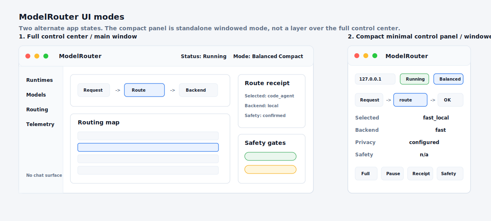

# Product North Star

This is the current ModelRouter product north star:

The image is directional product truth. It defines the product shape we are
building toward, not a claim that every visible control or panel is fully
implemented today. When full and compact surfaces appear in the same visual, read
them as a comparison of alternate modes. The compact surface is not an in-app
overlay on the full control center.

## Product Identity

ModelRouter is a local AI control center and routing/control plane. It exposes a
local OpenAI-compatible endpoint, helps users discover and assign local models,
shows route-aware recommendations, plans explicit downloads, controls configured
local model-server runtimes, routes requests, and records privacy-safe
telemetry. It is not an agent, not a webchat UI, and not a prompt transcript
product. It is also not a multi-agent harness: host applications own task
execution, context management, delegation, monitoring, and final review.

For common local-model workflows, the product can replace a separate local-model
app as the day-to-day control surface: scan installed models, choose
recommendations, download approved models, start or stop configured local
runtimes, expose the local `/v1` endpoint, and route traffic. For users who
already prefer another runtime or UI, ModelRouter should integrate alongside or
above LM Studio, Ollama, LocalAI, llama.cpp servers, MLX/MLX-LM, vLLM, generic
OpenAI-compatible backends, and hosted providers. The product stance is one
integrated local control center without lock-in.

Fusion-like harnesses can sit above ModelRouter. In that shape, ModelRouter is
the transparent control plane for model/provider policy, route receipts,
telemetry, fallback behavior, and safety gates, while the harness decides when
to delegate work or switch execution strategy.

The decision router is ModelRouter's default differentiator, but the product
should also support an explicit "decision layer off" path. In that mode,
ModelRouter behaves as a basic model gateway with manual backend selection,
model aliases, passthrough routing, health, fallback, telemetry, and model
management. This makes smart routing optional without weakening the default
router experience.

ModelRouter should not build a custom inference engine from scratch when proven
runtimes already exist. It should coordinate, configure, observe, and route
across those runtimes through explicit adapters and managed process boundaries.
The ownership boundary is defined in `docs/product-boundaries.md`.
The staged path for turning this into a fuller one-app local control-center
experience lives in `docs/roadmap.md`.
The detailed local-model app parity path lives in
`docs/lm-studio-parity-roadmap.md`: LM Studio is the floor, not the ceiling.

The product should make the operational state obvious before anything else:

- A local endpoint is visible and copyable.
- Proxy status, selected routing mode, active backend/model, local runtime
  status, telemetry status, and safety/policy state are always obvious.
- Routing policy is expressed in plain-language modes: `Fast`, `Balanced`,
  `Quality`, `Private`, and `Safe`.
- Route classes, provider/runtime choices, latency, cost, privacy, tool needs,
  fallback paths, and rejected routes are inspectable without reading YAML.
- Model library state, route-aware recommendations, and download eligibility
  are visible as operational rows or compact sections, not hero panels.
- Telemetry, cost/outcome labels, pricing catalog coverage, and coverage gaps
  are available without exposing prompt bodies.
- Local and hosted provider boundaries remain explicit.
- Safety gates and `human_confirm` behavior are visible and conservative.
- Receipts explain what happened, why, and how to label a wrong route.
- Telemetry supports dogfooding without exposing private prompt text by default.

## Intended Surface

ModelRouter has two alternate UI states, not a stacked parent/child interface:

1. **Full control center/main window**: the main settings surface started by
   `model-router settings`.
2. **Compact minimal control panel/windowed mode**: a smaller standalone app
   surface for quick proxy status, latest route, recent requests, and safe
   controls when the operator does not want the full-screen dashboard.

The compact panel is not a modal, overlay, child window, or layer floating over
the main dashboard. If product material shows both states together, it should be
captioned as a comparison of modes.

The full control center should feel like a local AI control center and proxy
routing plane:

- Local-only admin/config UI started by `model-router settings`.
- Top-level operational summary for proxy status, routing mode, active
  backend/model, local runtime status, telemetry health, and safety/policy
  state.
- Model discovery, local scan results, route-aware recommendations, explicit
  download plans, and route/model assignments as compact operational controls.
- Mode controls for `Fast`, `Balanced`, `Quality`, `Private`, and `Safe`.
- Request flow from incoming request to ModelRouter decision, selected engine,
  backend runtime, and response.
- Routing map/table with route classes, route ids, target descriptions,
  providers/runtimes, latency, cost, privacy, tools, and fallback behavior.
- Provider/runtime panel for llama.cpp, Ollama, LM Studio, MLX-LM,
  OpenAI-compatible providers, and related local or custom backends.
- Runtime command, model path, port, context, readiness, idle-timeout, start,
  stop, restart, and log controls where the runtime is managed.
- Route receipt panel showing selected engine, backend, model, rationale, risk,
  tools, fallback, rejected routes, confirmation state, latency, privacy, and
  receipt JSON.
- Safety panel for human-confirm gates.
- Recent requests/telemetry panel with usage, cost/outcome, catalog coverage,
  and wrong-route feedback entry points.

Recommendations and downloads should be treated as routine operations. The
default view should show recommended model, download eligibility, status, and
next action in dense rows or collapsible sections. Full install details,
alternatives, logs, and download actions should expand only when the operator
chooses to inspect them.

The compact windowed mode should feel like a standalone minimal control panel:

- Local endpoint, proxy status, routing mode/profile, active backend/model,
  local runtime status, and telemetry status.
- Key model/runtime state for the active route.
- Latest selected route/backend and high-level latency/safety/privacy state.
- Recent route summaries without prompt bodies.
- Quick links back to full control center sections.
- Explicit, confirmed proxy controls only.
- No chat surface and no prompt transcript surface.

The compact surface is a separate smaller app/window state for quick status and
safe controls. It must not be described or drawn as an overlay, modal, child
window, or floating panel on top of the full control center.

## Implemented Today

The current product already includes:

- Deterministic routing through `ModelRouter.route_fast(...)` and receipt-rich
  `ModelRouter.route(...)`.
- OpenAI-compatible proxy endpoints for supported request shapes.
- Local settings UI through `model-router settings`.
- Data-backed settings dashboard panels for the latest route receipt, configured
  routing map, provider/runtime config, recent telemetry, feedback labels,
  benchmark status, and proxy process controls.
- Model library surfaces for installed models, curated discovery,
  hardware-aware recommendations, explicit download plans, and route
  assignments.
- Visual proxy config editing for profile, observability, backend policy, and
  per-route backend/runtime fields with explicit Save/Apply/Restart actions.
- Response headers, receipts, and telemetry workflows that make route ids easier
  to identify and label.
- Opt-in managed local runtimes for configured llama.cpp and MLX-LM processes.
- A documented productization plan for shared admin state/actions and optional
  basic-router modes in `docs/codex/productization-roadmap.md`.

## In Progress

The north star assumes continued polish around:

- Richer route-map editing and profile/provider policy controls in the settings
  UI.
- Shared admin state/actions that power the web UI, future TUI, installer, and
  admin API without duplicated control-plane logic.
- Optional non-decision routing modes: manual backend, model aliases, and
  passthrough.
- More complete visual runtime status, readiness, logs, and managed-runtime
  controls.
- Continued dogfooding of the recent-request and wrong-route review loops before
  adding heavier review surfaces.
- Broader dogfood evidence from real local runtimes and benchmark-backed setup.

## Future Direction

Future UI work should align with the screenshot when it improves the proxy
control-center experience. If chat or playground workflows are ever added, they
should remain secondary to control-plane operations and should not displace
proxy status, routing mode, active backend/model, runtime health, telemetry,
catalog coverage, and safety/policy state. It should not add:

- A chat prompt box.
- Agent behavior.
- Hidden planner/worker orchestration.
- A custom inference engine that competes with proven local runtimes.
- A prompt transcript surface.
- Silent model downloads.
- Silent config or routing-policy mutation.
- Silent hosted-provider enablement.
- Raw prompt display unless prompt capture was explicitly configured and the UI
  marks the data as sensitive.

Downloads, config writes, benchmark runs, hosted-provider use, and proxy/runtime
process changes should remain explicit user actions.
